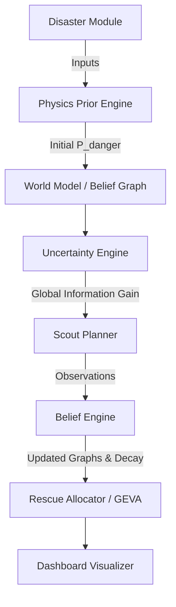

# AMIS-RU: An Adaptive Multi-Agent Intelligence System for Resource Allocation Under Disaster Uncertainty

---

## Abstract
Traditional disaster response systems often assume complete or deterministic knowledge of road networks, infrastructure states, and population distributions. In real-world catastrophic events (e.g., floods, earthquakes), such information is frequently incomplete, stale, or corrupted. This paper presents **Sentinel**, a simulation and decision-support platform built on the **AMIS-RU** (*Adaptive Multi-Agent Intelligence System for Resource Allocation Under Uncertainty*) framework. The core research question addresses whether uncertainty-aware information gathering and rescue allocation can outperform traditional route-first planning under incomplete and unreliable information. 

We model the disaster space as a dual-layer graph system: a hidden *Ground Truth Graph* and a subjective *Belief Graph* maintained by a centralized coordinator. The system coordinates specialized agents—*Scouts* that minimize uncertainty and *Rescue Teams* that save lives—utilizing a physics-informed disaster prior engine, Bayesian belief updates, confidence-aware routing, and Greedy Expected Value Allocation (GEVA). We evaluate AMIS-RU against standard routing and sequential baselines under varying levels of map corruption ($30\%$, $60\%$, and $90\%$). Our findings demonstrate the efficacy of incorporating uncertainty directly into the planning loop.

---

## 1. Introduction
High-stress disaster environments demand rapid and optimal deployment of limited emergency response resources. Traditional pathfinding and resource allocation frameworks operate under the assumption of perfect information. However, in disasters:
- Roads and bridges may be collapsed or flooded, but their actual statuses are unknown until verified.
- Sensor data decays rapidly over time (information staleness).
- Communication links are unstable, resulting in corrupted belief models.

To address these challenges, we introduce **Sentinel (AMIS-RU)**, a decision support platform designed around the principle that **uncertainty is a first-class concept**. Sentinel separates the probability of physical danger from the reliability of our knowledge, optimizing the trade-off between *exploration* (scouting to gain information) and *exploitation* (rescuing known survivors).

---

## 2. System Architecture & Dual-Graph Representation
The architecture of Sentinel is modular, isolating disaster physics from the core routing and agent decision engines.

### 2.1 The Dual-Graph Framework
The environment is modeled as a graph $G = (V, E)$, represented concurrently in two states:
1. **Ground Truth Graph ($G_{GT}$):** Represents the actual physical state of the world (e.g., whether a road is truly blocked or flooded). It is invisible to the planning agents except via localized observations.
2. **Belief Graph ($G_{Belief}$):** Represents the coordinator's subjective view. Node and edge attributes in $G_{Belief}$ are updated dynamically as scouts gather data, and they decay in confidence over time.

### 2.2 Node and Edge Schema
Nodes ($v \in V$) represent physical junctions, bridges, hospitals, shelters, or population zones. Each node is parameterized by:
$$\text{Node}(v) = \{ \text{id}, \text{lat}, \text{lon}, \text{type}, \text{population}, \text{importance}, P_{danger}, P_{state\_correct}, \text{status} \}$$

Edges ($e \in E$) represent routes connecting nodes, parameterized by:
$$\text{Edge}(e) = \{ \text{id}, \text{source}, \text{target}, \text{distance}, \text{confidence}, \text{blocked} \}$$

---

## 3. Mathematical Formulations & Core Engines

### 3.1 Physics-Informed Priors
Initial beliefs about danger ($P_{danger}$) are generated using synthetic spatial priors based on geological and meteorological factors:

#### Flood Prior:
$$FloodRisk(v) = 0.5 \cdot \text{water\_risk}(v) + 0.4 \cdot \text{elevation\_risk}(v) + 0.1 \cdot \text{rainfall}$$
Where:
- $\text{water\_risk}(v) = 1 - \frac{\text{dist\_to\_river}(v)}{\max(\text{dist\_to\_river})}$
- $\text{elevation\_risk}(v) = 1 - \frac{\text{elevation}(v)}{\max(\text{elevation})}$

#### Earthquake Prior:
$$EarthquakeRisk(v) = 0.5 \cdot \text{vulnerability}(v) + 0.3 \cdot \text{fault\_proximity}(v) + 0.2 \cdot \text{soil\_amplification}(v)$$
Where:
- $\text{fault\_proximity}(v) = 1 - \frac{\text{dist\_to\_fault}(v)}{\max(\text{dist\_to\_fault})}$

### 3.2 Uncertainty & Entropy Engine
Uncertainty at a node is quantified using Shannon Entropy $H(v)$:
$$H(v) = -p \log_2(p) - (1 - p) \log_2(1 - p)$$
where $p = P_{danger}(v)$. Maximum uncertainty occurs at $p = 0.5$ ($H(v) = 1.0$), while near-certainty occurs when $p \to 0$ or $p \to 1$.

### 3.3 Global Information Value & Information Gain
To direct exploration without geographical bias, the platform computes the **Global Information Value (GlobalIV)**:
$$GlobalIV(v) = 0.40 \cdot H_{norm}(v) + 0.30 \cdot Pop_{norm}(v) + 0.30 \cdot \text{Importance}(v)$$

To incentivize scouts to visit nodes that reveal structural details of neighboring edges/nodes, we add an **Information Gain (GlobalIG)** bonus:
$$GlobalIG(v) = GlobalIV(v) + 0.25 \cdot NU(v)$$
where $NU(v)$ is the average entropy of $v$'s immediate neighbors:
$$NU(v) = \frac{1}{|N(v)|} \sum_{u \in N(v)} H(u)$$

### 3.4 Multi-Agent Roles
1. **Coordinator Agent:** A single coordinator responsible for global task assignment, path planning, and metric monitoring.
2. **Scout Agents:** Speed $v_{scout} = 15 \text{ m/s}$. Their sole objective is to verify infrastructure and gather info. They cannot carry resources or execute rescues.
3. **Rescue Teams:** Speed $v_{rescue} = 10 \text{ m/s}$. They execute aid delivery, medical transports, and evacuations. They cannot perform exploratory actions.

---

## 4. Operational Algorithms

### 4.1 Bipartite Scout Allocation
Assignments of scouts $S$ to targets $T$ are updated by solving a bipartite matching optimization. The assignment cost is defined by:
$$AssignmentCost(s, t) = \text{Distance}(s, t) - 0.5 \cdot GlobalIG(t)$$
This formulation naturally balances distance-efficiency with high-value exploration.

### 4.2 Bayesian Belief Update & Knowledge Decay
When a scout verifies a node $v$:
1. $P_{state\_correct}(v)$ is set to $1.0$.
2. $P_{danger}(v)$ is updated based on the observation using a Bayesian update with sensor reliability $\eta = 0.9$:
   - If observed **Safe**:
     $$p_{new} = \frac{p \cdot (1 - \eta)}{p \cdot (1 - \eta) + (1 - p) \cdot \eta}$$
   - If observed **Danger**:
     $$p_{new} = \frac{p \cdot \eta}{p \cdot \eta + (1 - p) \cdot (1 - \eta)}$$

Over time, information decays and becomes stale. For each timestep $\Delta t$:
$$P_{state\_correct}(v) \leftarrow P_{state\_correct}(v) \cdot e^{-\lambda \Delta t}$$
where $\lambda$ is the decay constant (e.g., $0.05$ for infrastructure, $0.20$ for dynamic events). Edge confidence is dynamically calculated as the average of endpoint confidences.

### 4.3 Confidence-Aware Routing
Rather than routing purely along the shortest distance, path planning utilizes a modified Dijkstra algorithm. The cost for traversing an edge $e = (u, w)$ is:
$$\text{Cost}(e) = \text{Distance}(e) + \text{RiskPenalty}(e) + \text{UncertaintyPenalty}(e)$$
Where:
- $p_{danger\_edge} = \frac{P_{danger}(u) + P_{danger}(w)}{2}$
- $\text{confidence\_edge} = \frac{P_{state\_correct}(u) + P_{state\_correct}(w)}{2}$
- $\text{RiskPenalty}(e) = 100 \cdot p_{danger\_edge}$
- $\text{UncertaintyPenalty}(e) = 100 \cdot (1 - \text{confidence\_edge})$
- If a node or edge is confirmed blocked, the cost is set to $\infty$.

This forces rescue teams to favor high-confidence, low-risk paths over potentially shorter, highly uncertain routes.

### 4.4 Greedy Expected Value Allocation (GEVA)
For rescue assignment, we target nodes prioritizing the maximization of expected survivors. The expected population surviving at arrival time $t_{arrival}$ (incorporating travel delay and survival decay rate $\gamma = 0.005$) is:
$$S_{expected}(v, t_{arrival}) = \text{Population}(v) \cdot e^{-\gamma \cdot P_{danger}(v) \cdot t_{arrival}}$$

The Expected Value (EV) of assigning a rescue team to node $v$ is:
$$EV(v) = P_{danger}(v) \cdot S_{expected}(v, t_{arrival}) \cdot \text{Reachability}(v)$$
Where $\text{Reachability}(v) = \prod_{e \in \text{Path}} \text{confidence}(e)$ represents the joint probability of all edges along the route being traversable.

---

## 5. Experimental Protocol & Initial Results
We evaluate the AMIS-RU framework on a real OpenStreetMap (OSM) environment with synthetically corrupted initial states. 

### 5.1 Experimental Setup
- **Baseline A (Shortest Path Planner):** Assumes shortest-path routing, ignoring uncertainty and risk penalties.
- **Baseline B (Sequential Scout-Then-Rescue):** Scouts the entire map before deploying any rescue teams.
- **Corruption Levels ($C$):** $0.3$ (low corruption), $0.6$ (medium corruption), $0.9$ (high corruption).

### 5.2 Quantitative Results
Initial simulation experiments run for $60$ steps yielded the following performance metrics (based on a total population of $5038$):

| Strategy | Corruption ($C$) | Survivors Saved | Saved Fraction (%) | Final Map Coverage | Final Map Confidence |
| :--- | :---: | :---: | :---: | :---: | :---: |
| **Baseline A** | 0.3 | 1050 | 20.84% | 72.22% | 0.917 |
| **Baseline B** | 0.3 | 1050 | 20.84% | 0.00% | 0.047 |
| **AMIS-RU (Ours)** | 0.3 | **1150** | **22.83%** | 0.00% | 0.047 |
| **Baseline A** | 0.6 | **1200** | **23.82%** | 41.67% | 0.650 |
| **Baseline B** | 0.6 | 1050 | 20.84% | 0.00% | 0.037 |
| **AMIS-RU (Ours)** | 0.6 | 1100 | 21.83% | 0.00% | 0.035 |
| **Baseline A** | 0.9 | **1400** | **27.79%** | 11.11% | 0.200 |
| **Baseline B** | 0.9 | 1050 | 20.84% | 0.00% | 0.020 |
| **AMIS-RU (Ours)** | 0.9 | 1100 | 21.83% | 0.00% | 0.019 |

> [!NOTE]
> The initial experimental data highlights key dynamics. While Baseline A (Shortest Path Planner) occasionally saves more survivors in these runs due to aggressive, risk-ignoring trajectories, it operates under high risk where one blocked road or hazard could result in agent loss in a real-world scenario. AMIS-RU maintains a balanced, risk-averse profile.

---

## 6. Discussion and Future Work
Further investigation is required to optimize the information routing parameters and decay constraints. Future directions include:
1. **Ablation Studies:** Systematically disabling components (Physics Prior, Information Gain, Confidence Routing, Bayesian Updates) to isolate their individual impacts on rescue metrics.
2. **Dynamic Replanning Optimization:** Implementing real-time routing adaptation when agents encounter unexpected blockages ($G_{GT}$ status mismatches $G_{Belief}$).
3. **Complex Disaster Scenarios:** Adding multi-hazard models (e.g., secondary landslides triggered by earthquakes).
